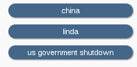
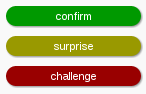
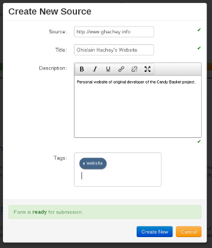

==========
User Guide
==========

This manual is for the pilot of the Mnemoniq software, release 1.0.
It is written in three sections.  The first sets out the purpose of
the software and describes how it is designed to improve an
organisation's ability to monitor and learn from the information it
collects.  It will be most useful to people using Mnemoniq in a
team-based environment.  The second section describes how to install
Mnemoniq on an intranet.  The third section is for developers who want
to play around with Mnemoniq and suggest improvements to be
incorporated into subsequent releases of the software.

Mnemoniq has been developed by Dan McGarry and Derek Brien of the
Pacific Institute for Public Policy (PiPP), Ghislain Hachey of
Nuzusys, and Louise Shaxson of ODI.  Feedback on the software, and on
this manual, will be welcomed: we are keen to improve it based on
people's experience of using Mnemoniq, and developers' ideas about
what it could do better.

Introduction
============

[Mnemonic: a tool designed to aid memory] 

Mnemoniq is a browser-based tool for improving your organisational
memory. Much of the information that organisations need to monitor
their performance is ephemeral, either tacit knowledge held in
people's heads or fragments of information from meetings, records of
phone conversations, thoughts that come to you on the bus, internet
links or bits of key reports.  Traditional knowledge management
systems work poorly for this, but Mnemoniq allows you to record and
tag any information that can be stored electronically and retrieve it
via a tag cloud.

For example, you come out of a meeting having been given a series of
insights into a project you're working and a link to a useful report
that others in the team ought to read. During the coffee break you had
a phone conversation with a collaborator on a different project that
suggests things are not going to plan.  Instead of sending round a
series of emails when you get back to the office (if you remember to),
Mnemoniq allows you to enter these 'memories' into your team's
collective memory instantaneously, commenting on what they mean for
the team and tagging them to reflect how your team works and what they
need to know.  As long as people keep entering their memories into
Mnemoniq, your organisation's collective memory will be up to date.

Mnemoniq is not just a storage tool, it is also a powerful way of
retrieving memories.  Because it is structured around a tag cloud, it
is very easy for anyone to dive into any level of detail they want to.
Someone waiting to go into a meeting can quickly review the latest
relevant memories to be sure that they are fully aware of what the
team collectively knows.  Managers can see whether themes are emerging
across different projects, review everything related to 'strategy' or
refresh their memory of the detail of a project.  It is particularly
useful in fast-moving or political environments where information
needs to be at people's fingertips.  Mnemoniq is mobile; you can enter
the information via tablets or smartphones meaning that you can record
a memory (and others can retrieve it) as soon as you have it.

What memories should you record and how should you tag them?
------------------------------------------------------------

Mnemoniq is not designed to store large pieces of information such as
reports or slideshows: these should be stored in your regular
knowledge management systems.  And you will already have systems for
recording the sort of information that goes into quarterly and annual
reports.  Mnemoniq stores everything else—the information that does
not get reported to others but that you and your team need to know to
ensure that you are on the right track.  It sits behind your own
organisation's own security systems so the information you enter is
secure which makes it a useful tool for storing sensitive information.
You can set the access to as many or as few people as you like, though
the more people who have access to it the better it functions as an
information-sharing tool.

What you record it is up to you but we suggest that once Mnemoniq is
installed for a team, you meet to discuss the sorts of information you
will find useful and to set a few ground rules about how to tag
it. The tags are predictive, meaning that as you begin to type the
text for a tag Mnemoniq throws up the tags that already exist.  This
helps ensure that dodgy spelling does not affect how information is
tagged.

You can develop as many tags as you like, but the software does
require you to use the three supertags: `confirm`, `challenge` and
`surprise`.  These draw on Irene Guijt's work on monitoring and
learning.  Mnemoniq was developed to help PiPP better monitor what it
was doing to foster political debate in the Pacific (see
www.pacificpolicy.org).  They needed to tag information according to
whether it confirmed that they were broadly on the right track
(confirm), indicated that there was a push back against what they were
doing (challenge), or was out of left field and needed to be thought
through in more detail (surprise).

Note that because it Mnemoniq is a system for recording information,
what it contains will come under the remit of any data protection
legislation that may be in force in your country.  What you record and
how you record it will need to be compliant.

Can I generate reports?
-----------------------

Although Mnemoniq's flexibility means that you can use it in pretty
much any way you choose, it will be most effective when it is used
honestly; sharing fragments of information that make sense to you and
your team but not necessarily to others.  The software therefore does
not allow you to generate reports, or contain other functions which
would allow the information to be viewed externally.

What sort of performance management systems does it require? 
------------------------------------------------------------

Mnemoniq needs to be actively managed as a tool for sharing
information and making sense of it.  Space needs to be made within
your team's decision-making systems to ensure that the information
people are putting into it is useful.  It is as important to take
information out as it is to put it in, which you can do by calling up
your team's memories at your regular team meetings and using it to
help decide what the information means in terms of what you need to
start doing, stop doing, keep doing or change.

Why does it not have more functionality? 
----------------------------------------

While the software is not just a dumping ground, it also does not do
your thinking for you.  You need to think about why you are putting
the information in so you can tag it in ways that will make sense to
your team.  And because what you will be putting in will be fragments
rather than whole documents (possibly photos accompanied by
half-digested thoughts, or audio files) you need to collectively think
about what it means when you take it out.

Using the tool
==============

Logging in
----------

In order to access Mnemoniq you will need to begin by typing in the
address of the URL. A username and password will be requested: once
you have entered them you will be taken to the Home page, an example
of which is shown in the screenshot below. The interface is designed
to work with touch, allowing you to use a mobile platform for ease of
entry and constant availability. This also allows you to enter the
information in an unobtrusive fashion.

Toolbar
-------

The black toolbar running along the top of the screen allows you to
navigate between pages and contains four options:

* **Home** The Home option takes you back to the main display page, such as the one displayed in the screenshot above. 
* **About** Contains links to the documentation.
* **Contact** Contains contact information.
* **Add new...** The Add new function allows you to add a new entry into the database.

Header 
------

The page contains a header and a subtitle at the top of the page,
below the toolbar, which you can define yourself.

Entry bar
---------

The entry bar (or search bar) allows entries to be selected
according to their tags. By entering keywords in the entry bar only
those entries which have been tagged with those keywords will be
selected. You can enter two or more words into the entry bar,
separated by a space, and only those entries which have been tagged with
both words will be displayed. By clicking the `X` on each tag you
will return to the full list of entries.

Word cloud 
----------

The word cloud displays all the tags which have been entered so
far. The size of the words reflects the number of times the tag has
been entered. The cloud is also clickable, giving you an
alternative way of selecting a group of entries. By clicking on one
of the words in the cloud, only those entries which have that tag will
be displayed.

.. image:: images/candy-basket-wordcloud.png
  :align: center

Once you have selected a tag, using either the entry bar or the word
cloud, the word cloud updates itself to reflect the tags in the refined
selection. You may then select a second tag by again clicking on the
word cloud. The previous search will not be cleared by doing so.

Tagging
-------

Tagging is the most important component of the software. 

General tags
------------

Once an entry has added, the tags associated with that entry will be
displayed on the left hand side. Tags are designed to be:

* Short
* Immediately comprehensible
* Lower case
* Not categories, but flexible
* Intuitive
* Technical jargon may be useful, as shadowing the language which is spoken within the user group may facilitate precision. 
* As you begin to specify a tag for an entry, tags which have already been entered will come up as suggestions. There are two reasons for this function, which is not intended to be prescriptive. For practical reasons, as it facilitates ease of entry on a mobile device and, importantly, it allows the number of equivalent tags to be reduced to reduce in order to streamline functions such as the word cloud.

Supertags
---------

A supertag is a special type of tag which will be coloured in either
green, yellow or red according to its content. This is a structured
form of tagging. While the other tags provide context, supertags
classify the information according to whether or not the entry
confirms, surprises or challenges what you are currently doing and
thinking beliefs. These tags float to the top of the tag list, and the
bar across the top gives you a visual indication of the proportion of
super tags.  This is designed to show you how things appear to be
developing:

* if the entire line is green (Confirm) it would indicate that you are either being complacent or ignoring information that might suggest you should be doing things differently
* if there is a high proportion of yellow, it could indicate you are working in a changing environment
* if there is a high proportion of red, it may indicate two things. One interpretation could be that what you are doing is inappropriate.  Another interpretation is that what you are doing is generating a backlash—which you may in fact see as progress, particularly if you are trying to change the terms of a debate

Tag count function
---------

The tag count function provides allows for a quick check-in of how
things appear to be going. However, should you be leaning heavily on
one category of supertag, you may want to think a little bit harder
about what the reason for that is. Given that employees are inputting
the information themselves, the information is easily biased in that
employees select which information is considered pertinent. Should you
find the majority of your supertags are:

* **Confirm**: then this would seem to indicate that you are being too complacent or ignoring challenging information (green). 
* **Surprise**: this may indicate, for example, a changing environment (yellow).
* **Challenge**: this may suggest that the work being done by the organisation may be inappropriate or need revision (red). 

Add new entry
-------------

When adding a new entry, there are four fields you need to fill in:

* The `Source` entry bar allows you to specify the URL from which your information is sourced. Even if you enter information offline this field does need to be filled in, but you can enter anything such as a.com or offline.com
* The `Title` field allows you to specify a title for your entry 
* The `Description` field should preferably be used to explain why you thought the entry was important. 
* The `Tags` field is used to enter tags. 

Once you have finished entering the fields select Save Changes and
Close to finish adding the entry. The entry then floats to the top of
the entry list, and the date it was created shows on the right hand
side.  If an entry is edited, the editing date is stored in the place
of the creation date, and it again floats to the top.

Submitting a new entry (or updating an existing one) will not be
accepted until the form is `ready` for submission. For example, when
adding a new entry a form will look like this.

Once you start entering valid data the fields will be marked ready and
you will be able to submit your entry. It will be clear when the form
is ready for submission.

Sources of information
----------------------

The information is added by individual employees. The tool is designed
to comprise external information, and may consist of anything, such
as:

* Photos
* Web sites
* Emails
* Short pieces of text entered offline
* Entering material which is not available online can either be manually
inputted, or the page number can be referenced. The URL can be
replaced with anything (such as offline.com), whether or not such an
URL exists.

Contact details
===============

For more information, please contact:

+----------------+---------------+-----------------------------------+-----------------------------------------------------+------------------------------------+
| Name           | Organisation  | Title                             | Issue                                               | Email Address                      |
+================+===============+===================================+=====================================================+====================================+
| Louise Shaxson | ODI           | Research Fellow                   | Monitoring techniques, feedback and general support | .. image:: images/louise-email.png |
+----------------+---------------+-----------------------------------+-----------------------------------------------------+------------------------------------+
| Dan McGarry    | PiPP          | Chief technologist                | Technical support                                   | .. image:: images/dan-email.png    |
+----------------+---------------+-----------------------------------+-----------------------------------------------------+------------------------------------+
| Derek Brien    | PiPP          | Executive Director and co-founder | Feedback                                            | .. image:: images/derek-email.png  |
+----------------+---------------+-----------------------------------+-----------------------------------------------------+------------------------------------+
